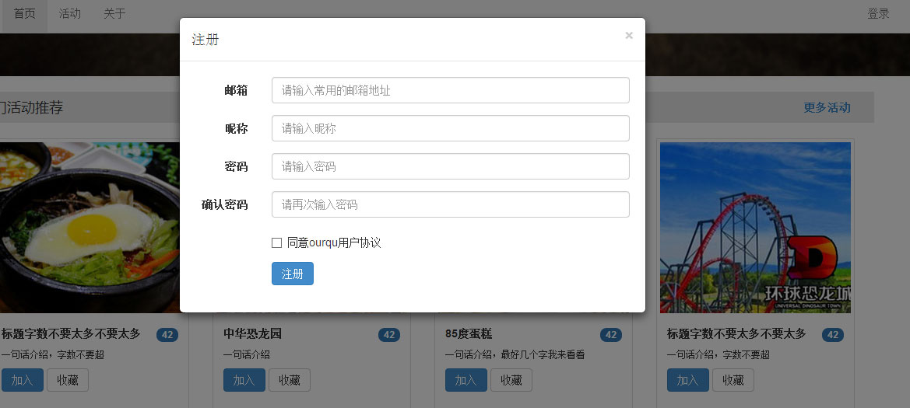

#ourqu文档#
##目录##
* index-v1.html /首页第一版
* indexv2.html /首页第二版
* new_room.html /创建活动
* room.html /活动详情页
* room_list.html /活动列表页
* user-center.html /用户中心（查看自己的资料，可以修改）
* user-index.html /查看别的用户时显示的用户资料页面
##按钮##
* 当按钮状态改变时，只需改变a标签的class,如下
* 加入 `<a href="#" class="btn btn-sm btn-primary" role="button">加入</a>`
* 收藏 `<a href="#" class="btn btn-sm btn-default" role="button">收藏</a>`
* 已加入 `<a href="#" class="btn btn-sm btn-success" role="button">已加入</a>`
* 已收藏 `<a href="#" class="btn btn-sm btn-danger" role="button">已收藏</a>`
##模态框##

* 登录注册，和创建房间时选择日期的错误提示都用模态框来显示.
    - 
    - 
* 模态框的调用方法
    - js调用：$('#myModal').modal()
    - 按钮点击：`<button class="btn btn-primary btn-lg" data-toggle="modal" data-target="#myModal">Launch demo modal</button>` 设置data-toggle="modal"，并使href="#myModal"或data-target="#myModal"指向特定ID的模态框
    - ps.模态框的id=myModal
* 模态框的的结构如下
    - 
##标签页
* 活动列表页和用户资料页面都使用了标签页.
    - 
* 标签的结构如下 
    - 
##表单验证
* 通过改变input的id来改变相应的输入框状态
* `<input type="text" class="form-control" id="inputSuccess">`
* `<input type="text" class="form-control" id="inputError">`
##分页控件##
* 激活和禁用状态
    - 链接在不同情况下可以定制。
    - 给不能点击的链接对应的li用.disabled,并且用.active显示是当前页。
